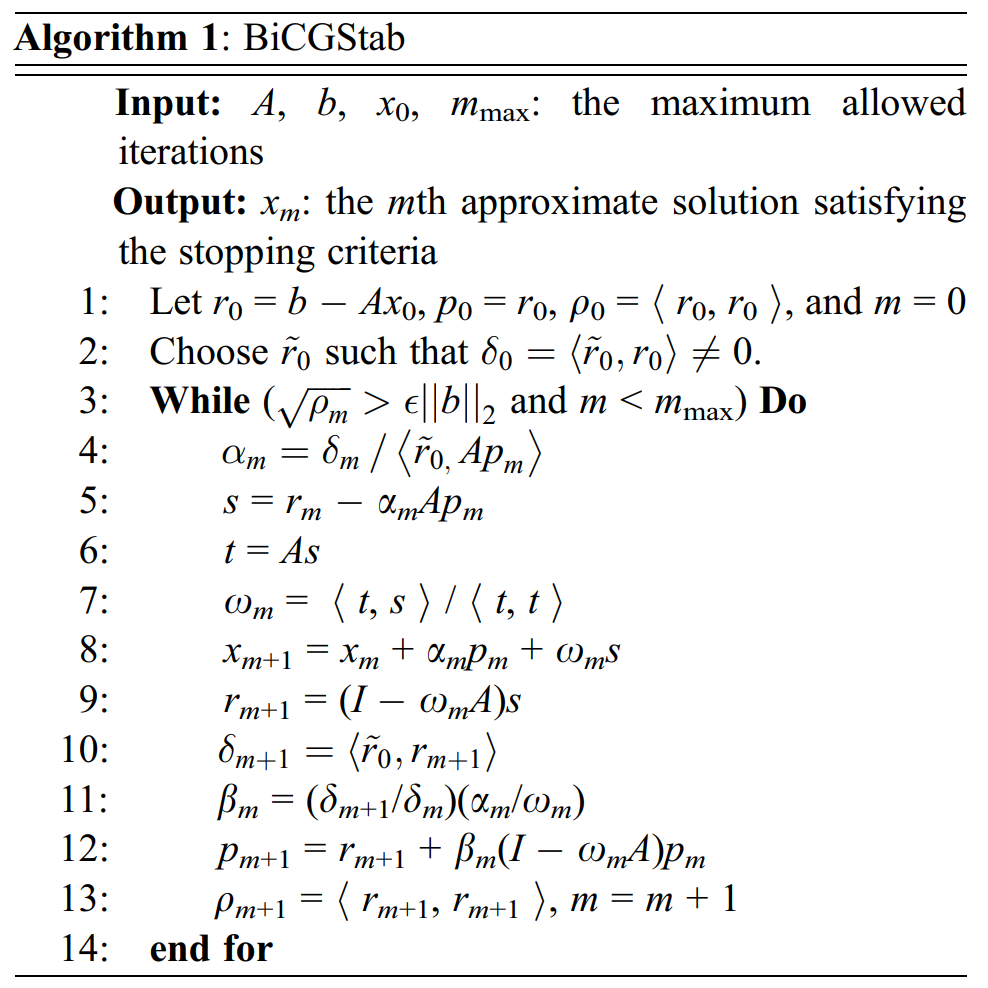

# <u>Projet de fin d'étude</u>

---

> #### <u>**Sujet :**</u> Etude et analyse de la parallélisation d'une méthode de résolution de système linéaire BICGSTAB

---

> De nos jours la plupart des processus industriels intègrent la simulation numérique comme outils pour la modélisation de phénomènes  complexe ou pour l'aide à la décision. C'est le cas par exemple dans l'industrie automobile ou l'ensemble de la chaine de production est aujourd'hui numérique et repose  sur la simulation. Lors de l'éxécution des codes de simulations, l'une des phases coûteuses est la résolution de systèmes linéaires.  Il existe deux grandes classes de méthodes, les méthodes directes et les méthodes itératives. Ces dernières sont de nos jours utilisées pour la résolution de grands systèmes creux.

---

> Nous nous intéressons dans ce projet aux méthodes itératives dites de Krylov et plus particulièrement à la méthode BICGSTAB dans le cas ou les matrices sont non-symétriques.  Dans un premier temps nous proposons une étude de cette méthode et proposons une implémentation dans un langage DSL comme Scilab, Octave, ou Python+Numpy). Puis nous proposons une parallélisation possible de cette méthode et étudions l'implémentation réalisée dans la bibliothèque PETSC.

> Les expérimentations seront réalisées sur des cas de la base de données UF sparse matrix collection, ainsi que sur les cas générés par le logiciel COMPASS. On pourra utiliser le module COMPASS.linalg pour réaliser ces expériences sur machine de calcul parallèle. L'analyse des méthodes et leurs implémentation implique des études de scalabilité qui seront réalisées sur différentes architectures.

----

### <u>**Idées :**</u>

+ Options avec flags

+ Modules disctincts

+ Fichier de traitement des données (YAML)

+ Hiérarchie des fichiers

----

### <u>**Hugo Henrote**</u>
